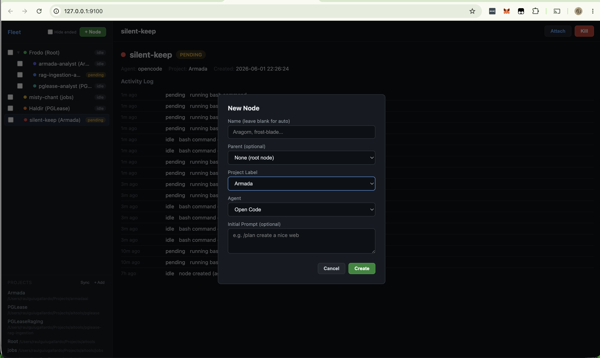
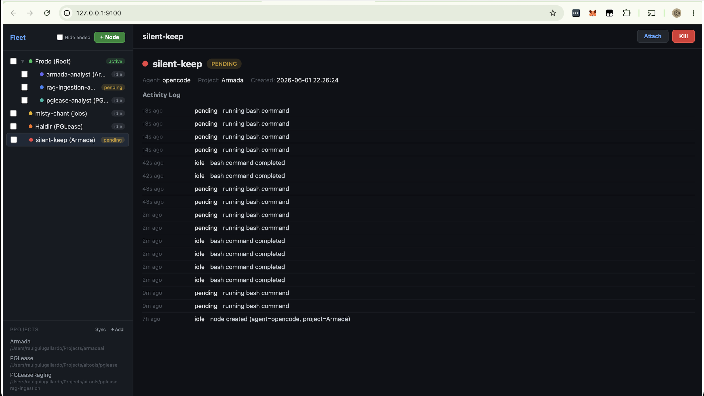

# Armada

> Command your fleet of AI agents from a single dashboard.

Armada lets you launch OpenCode and Claude Code agents in persistent tmux sessions, track their status live, and attach to any agent in a keystroke. Spawn workers, delegate tasks, monitor progress — all from your browser. Attach when you need to steer, detach and let them run in the background.

## Installation

**Prerequisites:** Python 3.10+, tmux (`brew install tmux`), OpenCode or Claude Code.

```bash
git clone https://github.com/rguiu/armada.git
cd armada
bash install.sh
```

That's it. `armada` is now available in your terminal. Open a new shell or run `source ~/.zshrc`.

<details>
<summary>Manual install (click to expand)</summary>

```bash
python3 -m venv .venv
source .venv/bin/activate
pip install -e .
armada setup
echo 'export PATH="$PWD/bin:$PATH"' >> ~/.zshrc
source ~/.zshrc
```

</details>

## Quick Start

```bash
armada              # Start the server + open dashboard
```

Open **http://127.0.0.1:9100**.

### 1. Register a project

In the sidebar **Projects** section, click **+ Add**. Give it an ID (slug), a name, and a directory path (or leave blank for the current directory).

### 2. Create a node

Click **+ Node**. Choose a name (or leave blank for auto-generated), select a project, pick an agent type — OpenCode, Claude Code, or Bash. Optionally provide an initial prompt.



### 3. Attach and work

Select the node and click **Attach**. You have two ways to interact:

**iTerm (macOS only)**

For OpenCode and Claude Code nodes, the node opens in a new iTerm tab by default. This gives you the full interactive TUI experience — arrow keys, mouse, and inline rendering all work natively. Close the tab anytime — the agent keeps running. Reattach later to pick up where you left off.

Toggle "Attach to iTerm" off to use the web terminal instead. Batch-attach multiple nodes at once using the **Attach** button in the toolbar (select checkboxes first).

**Web Terminal (in-browser xterm.js)**

When iTerm attachment is disabled (or you're on a non-macOS system), the node's tmux pane renders directly in the dashboard using xterm.js:

- **Real keystrokes** — every keypress is forwarded to the agent via WebSocket, no input field needed. Arrow keys, Enter, and Ctrl+C all work.
- **Interactive permission dialogs** — when the agent asks for permission (e.g. "Allow once / Allow always / Reject"), use **arrow keys + Enter** to navigate and select. The dialog is a keyboard-only TUI component — mouse clicks don't register.
- **Live sizing** — the terminal resizes to fill the available pane height and syncs column width with the tmux pane.
- **Horizontal scroll** on narrow screens.

> **Tip:** If the terminal display looks misaligned, try resizing your browser window slightly — the ResizeObserver adjusts the terminal rows dynamically.

### 4. Monitor

The dashboard polls every 10 seconds. See each node's current status, latest task, and full activity log.

### 5. QR Codes — connect from other devices

Armada supports two QR flows to open the dashboard on another device (phone, tablet, or another computer):

**From the dashboard sidebar**

Once the dashboard is open, the sidebar has a **QR** section at the bottom. Click **Show** to display a QR code encoding the full dashboard URL (including the auth token). Scan it with your phone's camera to open the dashboard instantly on that device — no typing required.

The QR auto-generates using the current URL, so it works whether you're on `localhost` or accessing Armada via LAN IP.

**From the CLI**

```bash
armada token --qr           # Print token + scannable QR (localhost)
armada token --qr --lan     # Use LAN IP for remote devices
armada --qr                 # Start server + show startup QR
armada --lan --qr           # Start server on LAN + show QR
```

The `--qr` flag prints an ASCII QR code in the terminal. Scan it to authenticate from another device on the same network. Combine with `--lan` to bind the server to your LAN IP (needed when connecting from other machines).



## Commands

| Command | Description |
|---|---|
| `armada` | Start daemon + open dashboard |
| `armada start` | Start daemon in background |
| `armada stop` | Stop the daemon |
| `armada attach` | Start in foreground (debugging) |
| `armada setup` | Install skills to user profile |
| `armada token` | Print the auth token |
| `armada token --qr` | Print token as scannable QR code |
| `armada token --qr --lan` | QR with LAN IP for remote devices |
| `armada --lan` | Start server bound to LAN IP |
| `armada --lan --qr` | Start on LAN + show startup QR |

## Example: Multi-Agent Pipeline

Three agents working on `shipping-api` in parallel:

```
Architect (orchestrator)
├── Reviewer (worker)  — reviews the code
└── Tests (worker)     — writes and runs tests
```

1. Start Armada: `armada`
2. In the dashboard, register the project (`shipping-api`) and create an orchestrator node
3. Attach to the orchestrator — it spawns workers, delegates tasks, and monitors results

The dashboard updates in real time as each worker reports active/idle.

## Features

- **Live tree dashboard** — dark theme, 10s auto-refresh, colour-coded status badges
- **Agent types** — OpenCode, Claude Code, or Bash workers
- **Initial prompts** — auto-type a prompt when a node starts
- **`/send` endpoint** — orchestrators assign tasks to workers via API
- **Pending status** — yellow pulsing badge when a node waits for input
- **Per-step activity logs** — agents report status before and after every action
- **Cascade kill & hide** — killing a parent also handles all descendants
- **Multi-select batch ops** — checkboxes in the tree for bulk kill/delete/attach
- **Web terminal** — view any node's tmux pane inline via xterm.js + WebSocket, bidirectional keystrokes, interactive permission navigation, horizontal scroll on narrow screens

## Architecture

SQLite (WAL mode) + FastAPI REST server, daemonized. Each node is a tmux window running an agent. Nodes report status via `POST /api/report`. The dashboard polls every 10 seconds.

```
┌──────────────────────────────────────────────────┐
│  Armada Dashboard (http://127.0.0.1:9100)         │
│  ┌─────────────┐  ┌─────────────────────────────┐│
│  │ Tree        │  │ Detail: "Architect"         ││
│  │             │  │ Status: active               ││
│  │ Architect ● │  │ Project: shipping-api        ││
│  │  ├─ Reviewer│  │ Message: "reviewing models"  ││
│  │  └─ Tests   │  │ [Attach] [Kill]              ││
│  │ + Node      │  │ Reports: ...                 ││
│  │ Projects    │  └─────────────────────────────┘│
│  │ + Add       │                                  │
│  └─────────────┘                                  │
└──────────────────────────────────────────────────┘
         │
    ┌────┴────┐
    │  tmux   │
    │  armada  │
    │ session │
    └─────────┘
```

## Agent Skills

Armada ships with three skills that teach agents how to operate as managed nodes:

| Skill | Purpose |
|---|---|
| [`armada-node`](skills/armada-node/SKILL.md) | Full node: reports status, spawns/kills children |
| [`armada-worker`](skills/armada-worker/SKILL.md) | Leaf node: reports status, single-task focus |
| [`armada-orchestrator`](skills/armada-orchestrator/SKILL.md) | Orchestrator: spawns workers, delegates via /send |

Skills install to `~/.config/opencode/skills/` and `~/.claude/skills/`. They auto-activate when `ARMADA_NODE_NAME` is set in the environment.

```bash
armada setup
```

## API Endpoints

| Method | Path | Purpose |
|---|---|---|
| `GET` | `/api/tree` | Full node hierarchy |
| `GET` | `/api/tree?hide_dead=true` | Live-only tree |
| `GET` | `/api/nodes` | Flat node list |
| `GET` | `/api/nodes?hide_dead=true` | Live-only node list |
| `POST` | `/api/nodes` | Create node |
| `GET` | `/api/nodes/:id` | Node detail + reports |
| `GET` | `/api/nodes/:id/reports` | Activity log |
| `GET` | `/api/nodes/history` | Recently killed nodes |
| `DELETE` | `/api/nodes/:id` | Kill node + cascade |
| `PATCH` | `/api/nodes/:id` | Hide node (`{"action":"hide"}`) |
| `POST` | `/api/nodes/:id/send` | Send command to worker |
| `POST` | `/api/nodes/:id/attach` | Open terminal attached to node |
| `GET` | `/api/nodes/:id/terminal` | Pane content + dimensions (web terminal) |
| `POST` | `/api/report` | Agent status report |
| `GET/POST/DELETE` | `/api/project-labels` | CRUD project directories |

## Development

```bash
python3 -m venv .venv && source .venv/bin/activate
pip install -e ".[test]"
```

### Tests

```bash
pytest                          # Run all tests
pytest --cov=armada_ai          # With coverage report
```

### Lint

```bash
pip install ruff
ruff check armada_ai/ tests/
```

### CI

On push/PR to `main`, GitHub Actions runs **ruff** + **pytest-cov** on Python 3.10–3.13 (80% coverage threshold).

## License

MIT
