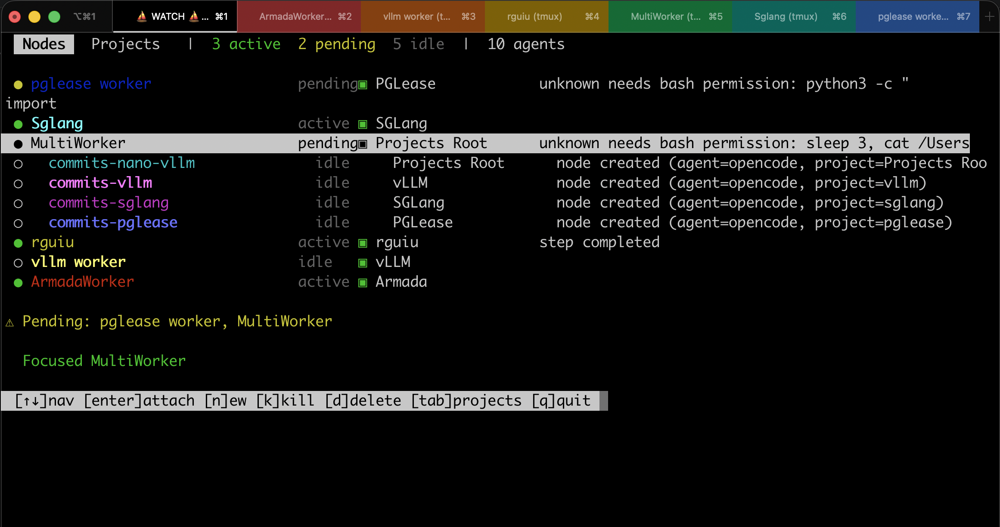
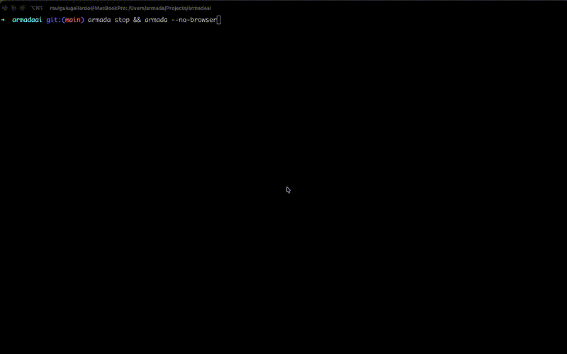

```
   █████╗ ██████╗ ███╗   ███╗ █████╗ ██████╗  █████╗
  ██╔══██╗██╔══██╗████╗ ████║██╔══██╗██╔══██╗██╔══██╗
  ███████║██████╔╝██╔████╔██║███████║██║  ██║███████║
  ██╔══██║██╔══██╗██║╚██╔╝██║██╔══██║██║  ██║██╔══██║
  ██║  ██║██║  ██║██║ ╚═╝ ██║██║  ██║██████╔╝██║  ██║
  ╚═╝  ╚═╝╚═╝  ╚═╝╚═╝     ╚═╝╚═╝  ╚═╝╚═════╝ ╚═╝  ╚═╝
```

> Persistent sessions and live supervision for coding agents.

[](https://pypi.org/project/armada-ai/)
[](https://test.pypi.org/project/armada-ai/)
[](https://pypi.org/project/armada-ai/)
[](https://github.com/rguiu/armada/blob/main/LICENSE)

## What is Armada?

Armada runs coding agents in persistent tmux sessions and lets you monitor and control them from a terminal dashboard or web UI.

Each agent runs in its own session and maintains state across reconnects, restarts, and devices.

## Key Features

- **Persistent agent sessions** — every agent runs inside a tmux session and survives disconnects
- **Live status tracking** — see `active`, `idle`, `pending`, `error` in real time
- **Terminal + web control** — manage agents via `armada nodes --watch` or the web dashboard
- **Multi-agent workflows** — spawn child workers, delegate tasks, coordinate execution
- **Message system** — structured communication between agents with event-driven delivery
- **MCP integration** — agents interact with Armada through typed tools, not curl commands

## Installation

**Prerequisites:** Python 3.10+, tmux, and either OpenCode or Claude Code installed on your PATH.

```bash
pip install armada-ai
armada setup                # install agent skills and MCP config
```

`armada` is now available. You can also install from source or run via Docker — see below.

<details>
<summary>Docker</summary>

```bash
docker build -t armada .
docker run -d -p 9100:9100 --name armada armada
```
</details>

<details>
<summary>From source</summary>

```bash
git clone https://github.com/rguiu/armada.git
cd armada
bash install.sh
```
</details>

## Quick Start

```bash
armada                     # start server + open dashboard
```

Open `http://127.0.0.1:9100`.

1. **Register a project** — sidebar Projects → **+ Add**. Give it an ID, name, and directory path.
2. **Create a node** — click **+ Node**, pick a project, choose an agent type (OpenCode, Claude Code, or Bash), optionally add an initial prompt.
3. **Attach** — select the node and click **Attach**. Opens the agent session in iTerm2 (macOS) or in-browser via xterm.js.
4. **Monitor** — see status, activity logs, and task history in real time.
5. **Connect other devices** — scan the QR code in the sidebar to open the dashboard on your phone or tablet.



## CLI Dashboard

`armada nodes --watch` is a live terminal dashboard for managing agents without a browser:

```
$ armada nodes --watch

 Nodes   Projects   |  3 active  1 pending  12 idle  |  23 agents

 ● HOOK20           ▣ idle   PGLease            unknown needs external_directory
 ○ HOOK18             idle   PGLease            server restarted — reconnected
 ○ H1                 idle   Armada
 ○ Armada-006         idle   Armada
 ● Armada-005         active Armada             running bash

 ⚠ Pending: HOOK20

 ┃ [↑↓]nav [enter]attach [n]ew [k]kill [d]delete [tab]projects [q]quit ┃
```



<details>
<summary>Full keybindings and forms</summary>

| Key | Action |
|---|---|
| `↑` `↓` | Navigate agent list |
| `Enter` | Attach to selected node (focuses existing pane) |
| `a` | Split-attach (experimental) |
| `n` | New node (interactive form) |
| `k` | Kill selected node |
| `d` | Delete selected node |
| `Tab` | Switch to Projects view |
| `q` | Quit |

Forms for creating nodes and projects use keyboard navigation: `Tab`/`↑↓` to move between fields, `←→` to cycle options, type freely in text fields, `Enter` on `[Save]` to submit, `Esc` to cancel.
</details>

## Agent Types

Armada supports Claude Code, OpenCode, and Bash as agent types.

### OpenCode

- **MCP Server** — typed tools (`spawn_node`, `send_message`, `report_status`, etc.) directly in the agent's tool palette. Auto-configured via `opencode.json`.
- **Plugin system** — an `armada-pending` plugin hooks into OpenCode's event loop. Agents automatically report status.
- **Skills** — `armada-node` and `armada-worker` skill files teach agents orchestration and messaging patterns.

To use: install OpenCode, make sure `opencode` is on your PATH, run `armada setup`.

### Claude Code

- **Hook system** — four shell hooks fire on tool use, idle transitions, and permission requests. These use the `armada report` CLI to report status.
- **Skills** — the same skill files are installed to `~/.claude/skills/` and auto-activate when `ARMADA_NODE_NAME` is set.

To use: install via `npm install -g @anthropic-ai/claude-code`, make sure `claude` is on your PATH, run `armada setup`.

### Bash

Bare shell nodes without an agent. Useful for running scripts or manual commands. Armada provides a bash wrapper with status reporting functions.

### Which one?

| | OpenCode | Claude Code |
|---|---|---|
| **Install** | `pip install opencode` | `npm install -g @anthropic-ai/claude-code` |
| **Status reporting** | Plugin (TypeScript, event-driven) | Shell hooks (pre/post-tool, stop) |
| **Permissions** | Permission events in plugin | `claude-permission.sh` hook |
| **Cost tracking** | Token usage from step-finish events | Not built in |
| **Best for** | Open-source workflows, custom plugins | Anthropic ecosystem, official support |

Either works. Pick based on which agent you already have installed.

## Agent Delegation

Agents can delegate work to child nodes using MCP tools:

```
Orchestrator
├── Reviewer  — reviews the code
└── Tests     — writes and runs tests
                └── sends "job completed" message back to Orchestrator
```

1. Start Armada: `armada`
2. Register a project and create an orchestrator node
3. The orchestrator uses `spawn_node("reviewer")` and `send_task(node_id, "review the auth module")`
4. Workers send completion messages back via `send_message(to_node_id=parent_id, payload="job completed", msg_type="result")`
5. The orchestrator collects results via `read_inbox()` and cleans up with `kill_node()`

See [examples/](examples/) for tested workflows: parallel feature builds, multi-project security audits, work queues, and code review pipelines.

## MCP Server

Armada includes an MCP server that exposes operations as typed tools for AI agents:

| Tool | Purpose |
|------|---------|
| `spawn_node(name)` | Spawn a child node (inherits agent_type, project, parent) |
| `send_task(node_id, command)` | Send command to node (auto-waits for tmux init) |
| `kill_node(node_id)` | Kill node and descendants |
| `get_tree()` | Full node hierarchy with status |
| `report_status(status, message)` | Report own status |
| `send_message(to_node_id, payload)` | Send message to another node |
| `read_inbox()` | Read pending messages |
| `broadcast(payload)` | Send message to all children |
| `post_to_queue(payload)` | Post task to shared work queue |
| `claim_from_queue()` | Claim next available queue task |

Auto-configured when nodes are created. Run manually with `armada mcp`.

## Inter-Node Messaging

Nodes communicate through a task mailbox with event-driven delivery:

- **Direct messages** — any node can send structured messages to any other node
- **Broadcast** — fan-out a message to all children with one call
- **Work queue** — post tasks to a shared queue for any idle agent to claim
- **Event-driven delivery** — no polling; the server pushes messages via tmux when the recipient goes idle
- **Completion notifications** — workers notify their parent when a task is done

## Architecture

Armada uses a FastAPI server with SQLite (WAL). Each agent is backed by a tmux session — no custom agent runtime, just tmux providing persistence, reconnection, and multiplexing. Nodes report status via `POST /api/report`. The dashboard refreshes over a persistent WebSocket.

## Commands

| Command | Description |
|---|---|
| `armada` | Start daemon + open dashboard |
| `armada --no-browser` | Start server without opening browser |
| `armada stop` | Stop the daemon |
| `armada nodes --watch` | Live terminal dashboard |
| `armada create -p <project>` | Create a new agent node |
| `armada nodes` | List all agents |
| `armada attach <name>` | Attach to a node by name |
| `armada projects` | List projects |
| `armada projects add <id> <name> <path>` | Register a project |
| `armada setup` | Install skills and MCP config |
| `armada mcp` | Start the MCP server (stdio mode) |
| `armada report <status> <msg>` | Report node status |
| `armada doctor` | Clean up stale sessions and DB state |
| `armada --lan` | Bind to LAN IP (access from other devices) |

## API Endpoints

| Method | Path | Purpose |
|---|---|---|
| `GET` | `/api/tree` | Full node hierarchy |
| `POST` | `/api/nodes` | Create node |
| `GET` | `/api/nodes/:id` | Node detail + reports |
| `DELETE` | `/api/nodes/:id` | Kill node + cascades to children |
| `POST` | `/api/nodes/:id/send` | Send command to worker |
| `POST` | `/api/report` | Agent status report |
| `POST` | `/api/nodes/:id/messages` | Send message to node |
| `GET` | `/api/nodes/:id/messages` | Read node inbox |
| `PATCH` | `/api/messages/:id` | Acknowledge message |
| `POST` | `/api/nodes/:id/broadcast` | Broadcast to all children |
| `POST` | `/api/queue` | Post task to work queue |
| `GET` | `/api/queue` | List unclaimed tasks |
| `POST` | `/api/queue/:id/claim` | Claim a queue task |
| `GET/POST/DELETE` | `/api/project-labels` | CRUD project directories |
| `GET` | `/health` | Health check |
| `GET` | `/metrics` | Prometheus metrics |

Full API docs at `http://127.0.0.1:9100/docs` (FastAPI Swagger UI).

## Development

```bash
python3 -m venv .venv && source .venv/bin/activate
pip install -e ".[test]"

pytest                          # run tests
pytest --cov=armada_ai          # with coverage
ruff check armada_ai/ tests/    # lint
```

CI runs ruff + pytest-cov on Python 3.10-3.13 on push to `main`.

## License

MIT
