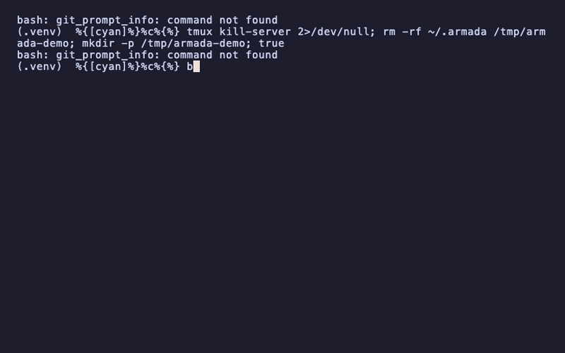

# Armada

> Terminal orchestration for Open Code and Claude Code agents.

Manage multiple AI coding agents as a **hierarchy of tmux nodes** with a live dashboard. Orchestrator nodes can **spawn worker children**, delegate tasks, monitor progress, and clean up — all through a local web UI.



## How It Works

```
┌──────────────────────────────────────────────────┐
│  Armada Dashboard (http://127.0.0.1:9100)         │
│  ┌─────────────┐  ┌─────────────────────────────┐│
│  │ Tree        │  │ Detail: "Architect"         ││
│  │             │  │ Status: active               ││
│  │ Architect ● │  │ Project: shipping-api        ││
│  │  ├─ Reviewer│  │ Message: "reviewing models"  ││
│  │  └─ Tests   │  │ [Attach] [Kill]              ││
│  │             │  │ Reports: ...                 ││
│  │ + Node      │  └─────────────────────────────┘│
│  │             │                                  │
│  │ Projects    │                                  │
│  │ shipping-api│                                  │
│  │ + Add       │                                  │
│  └─────────────┘                                  │
└──────────────────────────────────────────────────┘
         │
    ┌────┴────┐
    │  tmux   │
    │  armada  │
    │ session │
    └─────────┘
```

Each node is a tmux window running an AI agent (Open Code or Claude Code). Nodes can have a parent-child relationship forming a tree. Orchestrator nodes spawn children via the Armada API. The dashboard shows the full hierarchy with live status, recent activity, and logs.

## Installation

**Prerequisites:** Python 3.10+, tmux (`brew install tmux`), Open Code or Claude Code.

```bash
git clone https://github.com/your-username/armada.git
cd armada
python3 -m venv .venv
source .venv/bin/activate
pip install -e .

# Install skills to user profile (once, works for all projects)
armada setup
```

Add the wrapper to your PATH for the `armada` command anywhere:

```bash
echo 'export PATH="$HOME/Projects/armada/bin:$PATH"' >> ~/.zshrc
source ~/.zshrc
```

## Quick Start

```bash
armada              # Start the server (daemon) + open dashboard
```

Open http://127.0.0.1:9100.

### Step 1: Register a project

In the sidebar **Projects** section, click **+ Add**. Give it an ID (slug), a name, and a directory path (or leave blank for the current directory).

### Step 2: Create a node

Click **+ Node**. Choose a name (or leave blank for auto-generated), select a project, pick an agent type (opencode / claude / bash).

### Step 3: Attach and work

Select the node in the tree and click **Attach**. This opens a terminal tab connected to the node's tmux window. The agent receives Armada status reporting instructions automatically.

### Step 4: Monitor

The dashboard polls every 10 seconds. You can see each node's current status, latest task, and full activity log. The tree shows parent-child relationships.

## Commands

| Command | Description |
|---|---|
| `armada` | Start daemon + open dashboard |
| `armada start` | Start daemon in background |
| `armada stop` | Stop the daemon |
| `armada attach` | Start in foreground (debugging) |
| `armada setup` | Install skills to user profile |

## API Endpoints

| Method | Path | Purpose |
|---|---|---|
| `GET` | `/api/tree` | Full node hierarchy |
| `GET` | `/api/nodes` | Flat node list |
| `POST` | `/api/nodes` | Create node |
| `DELETE` | `/api/nodes/:id` | Kill node + cascade children |
| `POST` | `/api/nodes/:id/attach` | Open terminal attached to node |
| `GET` | `/api/nodes/:id` | Node detail + reports |
| `GET` | `/api/nodes/:id/reports` | Node activity log |
| `POST` | `/api/report` | Agent status report (hook) |
| `GET/POST/DELETE` | `/api/project-labels` | CRUD project directories |

## Agent Skills

Armada ships with three skills that teach agents how to operate as managed nodes:

| Skill | Purpose |
|---|---|
| [`armada-node.md`](skills/armada-node.md) | Full node: reports status, spawns/kills children |
| [`armada-worker.md`](skills/armada-worker.md) | Leaf node: reports status, single-task focus |
| [`armada-orchestrator.md`](skills/armada-orchestrator.md) | Orchestrator: spawns workers, delegates, monitors |

### Installing Skills

Run once — installs to your user profile for all projects:

```bash
armada setup
```

This copies the skills to:
- `~/.opencode/skills/` (Open Code user-wide)
- `~/.claude/skills/` (Claude Code user-wide)

Skills auto-activate when you launch an agent in an Armada-managed tmux window. The agent automatically reports status on every turn via `curl` to the Armada API.

When creating a node, Armada also copies skills to the project's `.opencode/skills/` as a fallback.

### Skill Behavior

- **`armada-node`**: Reports status at start/end of every response. Can spawn child nodes, check their progress, and kill them when done.
- **`armada-worker`**: Reports status only. Focused on completing a single task assigned by a parent.
- **`armada-orchestrator`**: Manages a team. Breaks work into parallel streams, spawns workers per stream, monitors their status, collects results, and cleans up.

## Example: Multi-Agent Code Review Pipeline

Let's say you're building `shipping-api` in `/Users/you/projects/shipping-api`. You want three agents working in parallel:

```
Architect (orchestrator)
├── Reviewer (worker)  — reviews the code
└── Tests (worker)     — writes and runs tests
```

### Setup

```bash
# 1. Start Armada
armada

# 2. Register project
# In dashboard: Projects → + Add
#   ID: shipping-api
#   Name: Shipping API
#   Path: /Users/you/projects/shipping-api

# 3. Create orchestrator
# In dashboard: + Node
#   Name: Architect
#   Project: Shipping API
#   Agent: opencode

# 4. Skills already installed globally by 'armada setup' — no per-project copy needed.

# 5. Attach to Architect and start working
# Click Architect in tree → Attach
# The agent now has the armada-orchestrator skill loaded
```

### Architect's Workflow

The Architect (with `armada-orchestrator` skill) will:

1. Analyze the codebase structure
2. Spawn a `Reviewer` node for code review:
   ```bash
   curl -s -X POST http://127.0.0.1:9100/api/nodes \
     -H "Content-Type: application/json" \
     -d '{"name":"Reviewer","parent_id":1,"project_label_id":"shipping-api","agent_type":"opencode"}'
   ```
3. Spawn a `Tests` node for test writing
4. Monitor both via `GET /api/tree`
5. Collect results and kill workers when done

The dashboard shows the full tree updating in real time. Each worker reports "active" / "idle" as it works.

## File Locations

| Path | Purpose |
|---|---|
| `~/.armada/armada.db` | SQLite database |
| `~/.armada/server.pid` | Daemon PID file |
| `~/.armada/hooks/<name>.md` | Per-node hook instructions |

## Architecture

See [PLAN.md](PLAN.md) for the full architecture, database schema, and development roadmap.

## Demo

Generate the demo GIF shown above:

```bash
brew install vhs
vhs demo.tape
# Output: demo.gif
```

## License

MIT
