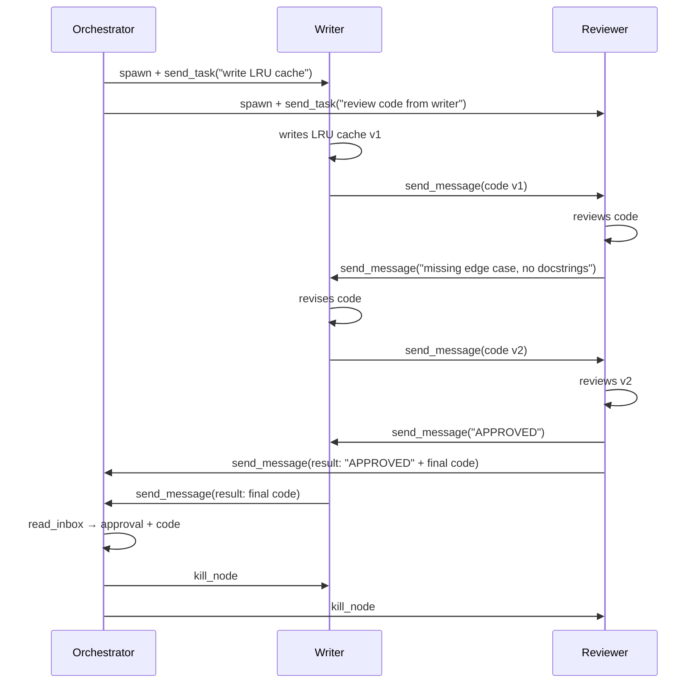

# Code Review Pipeline

A writer agent produces code, a reviewer agent reviews it, and they iterate via messaging until the code is approved. Multi-round bidirectional communication between siblings.

## Pattern: Multi-Round Bidirectional

```
Orchestrator
  ├── writer    writes code, revises based on feedback
  └── reviewer  reviews code, sends feedback or approval
        ↕ multiple rounds via send_message

Round 1: writer sends code → reviewer sends feedback
Round 2: writer sends revision → reviewer sends feedback
Round 3: writer sends revision → reviewer sends "APPROVED"
```

## Why Messaging Instead of send_task?

`send_task` injects text into a node's terminal -- it's one-shot. The review pipeline needs multi-round back-and-forth where each agent responds to what the other said. `send_message` + `read_inbox` enables this conversation pattern.

## Expected Message Flow

```
1. Orchestrator spawns writer and reviewer
2. writer produces code, sends to reviewer via send_message
3. reviewer reads inbox, reviews, sends feedback to writer via send_message
4. writer reads inbox, revises code, sends v2 to reviewer
5. reviewer reviews v2, sends "APPROVED" to writer AND orchestrator
6. Orchestrator reads inbox, collects final code, kills workers
```

**Messages:** 4-6 (depending on rounds needed)

### Sequence Diagram



## Prompt

Paste this into an orchestrator node:

```
Spawn two workers: "writer" and "reviewer".

writer should: Write a Python class that implements an LRU cache with get, put,
and delete methods. Send the code to reviewer via send_message (use get_tree to
find reviewer's node ID). Then check read_inbox for feedback. If reviewer sends
changes requested, revise the code and send again. Repeat until reviewer sends
"APPROVED". Then send the final approved code to me (parent, use get_my_info
for parent_id) with msg_type="result".

reviewer should: Check read_inbox for code from writer. Review it for:
correctness, edge cases, clean code style, and docstrings. If it needs changes,
send specific feedback to writer via send_message listing what to fix. If it
passes review, send "APPROVED" to writer AND to me (the orchestrator/parent)
with msg_type="result" including the final code. Maximum 3 review rounds --
approve on round 3 regardless.

Monitor via read_inbox. Once reviewer sends approval, collect the final code
and kill both workers.
```

## What Success Looks Like

- writer sends initial code to reviewer
- reviewer provides specific, actionable feedback (not just "looks good")
- writer's revision addresses the feedback
- Multiple rounds visible in the dashboard activity log
- Final "APPROVED" message arrives in both writer's and orchestrator's inbox
- Code quality improves measurably between rounds
