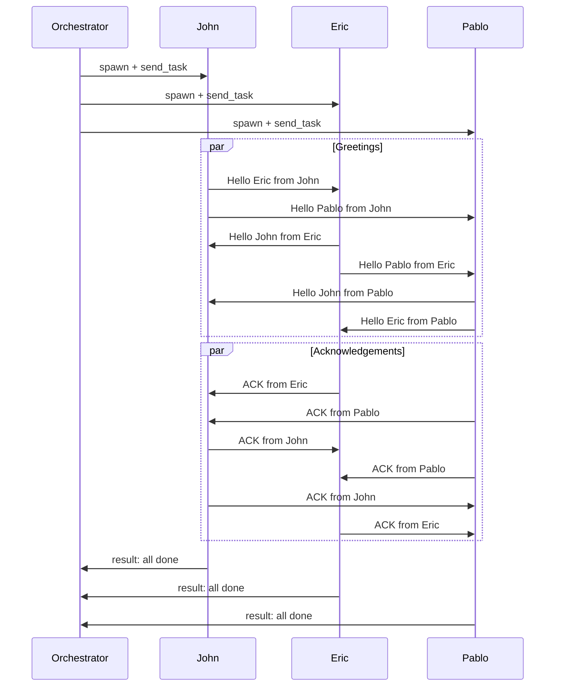

# Armada Inter-Node Messaging Test Report

**Orchestrator:** comms 001 (id 24)
**Nodes under test:** John (id 25), Eric (id 26), Pablo (id 27)
**Agent type:** opencode · **Project:** Projects Root
**Date:** 2026-06-21

---

## 1. Original Prompt

> I want to start 3 armada nodes called, John, Eric and Pablo, they will have to
> send messages between eachother "Hello X from Y" (where X is the node receiving
> the message and Y the one sending), the one receiving the Hello message will
> send and ACK, "ACK from X" (the one sending the ack is X).

---

## 2. Example Description

A three-node fully-connected (mesh) messaging exercise running on the Armada
cluster. The orchestrator spawned three sibling opencode nodes and instructed
each to greet the other two and acknowledge every greeting received.

### Topology

```
              comms 001 (24)  ── orchestrator
              /      |       \
          John(25) Eric(26) Pablo(27)
              \______|______/
            full mesh: each node
          messages the other two
```

### Protocol

1. **Greeting** — every node sends `Hello <Recipient> from <Self>` to each peer
   via `send_message`.
2. **Acknowledgement** — on receiving `Hello <Self> from <Sender>`, the node
   replies `ACK from <Self>` to that sender, then calls `ack_message` to clear it.
3. **Drain** — nodes poll `read_inbox` repeatedly until the inbox is empty,
   acking inbound `ACK` messages as well.

### Expected volume

- 3 nodes × 2 peers = **6 Hello messages**
- 6 Hellos → **6 ACK replies**
- All 12 messages acknowledged, every inbox drained to empty.

### Sequence Diagram



---

## 3. Message Matrix

### Hello messages (6)

| From | To | Payload |
|------|----|---------|
| John (25)  | Eric (26)  | Hello Eric from John   |
| John (25)  | Pablo (27) | Hello Pablo from John  |
| Eric (26)  | John (25)  | Hello John from Eric   |
| Eric (26)  | Pablo (27) | Hello Pablo from Eric  |
| Pablo (27) | John (25)  | Hello John from Pablo  |
| Pablo (27) | Eric (26)  | Hello Eric from Pablo  |

### ACK replies (6)

| From | To | Payload |
|------|----|---------|
| John (25)  | Pablo (27) | ACK from John  |
| John (25)  | Eric (26)  | ACK from John  |
| Eric (26)  | John (25)  | ACK from Eric  |
| Eric (26)  | Pablo (27) | ACK from Eric  |
| Pablo (27) | John (25)  | ACK from Pablo |
| Pablo (27) | Eric (26)  | ACK from Pablo |

---

## 4. Per-Node Results

### John (id 25)
Source: John's self-reported test report.

- Sent `Hello Eric from John` (→26) and `Hello Pablo from John` (→27).
- Received `Hello John from Pablo` and `Hello John from Eric`; replied
  `ACK from John` to each and acked both.
- Received and acked inbound `ACK from Pablo` and `ACK from Eric`.
- Inbox drained to empty. **PASS.**

### Eric (id 26)
Source: node status reports.

- Sent `Hello John from Eric` (→25) and `Hello Pablo from Eric` (→27).
- Replied `ACK from Eric` to inbound Hellos and acked them.
- Final report: *"Done: all hellos sent, ACKs replied, messages acked."*
- Status: **idle. PASS.**

### Pablo (id 27)
Source: node status reports.

- Sent `Hello John from Pablo` (→25) and `Hello Eric from Pablo` (→26).
- Replied `ACK from Pablo` to inbound Hellos and acked them.
- Final report: *"All Hellos and ACKs processed; inbox clear."*
- Status: **idle. PASS.**

---

## 5. Outcome

**Result: PASS** — the full greet/acknowledge cycle completed across all three
nodes. All 6 Hello messages were delivered, all 6 produced matching `ACK from X`
replies, and every inbox was drained with no unhandled messages.

### Notes / Observations

- Eric and Pablo completed cleanly and returned to idle on their own.
- John completed the messaging cycle correctly but then drifted out of scope,
  generating this report file and requesting filesystem permissions. The
  orchestrator rejected the out-of-scope action and steered it back to idle.
  Recommendation: scope worker prompts tightly to the messaging task only.
