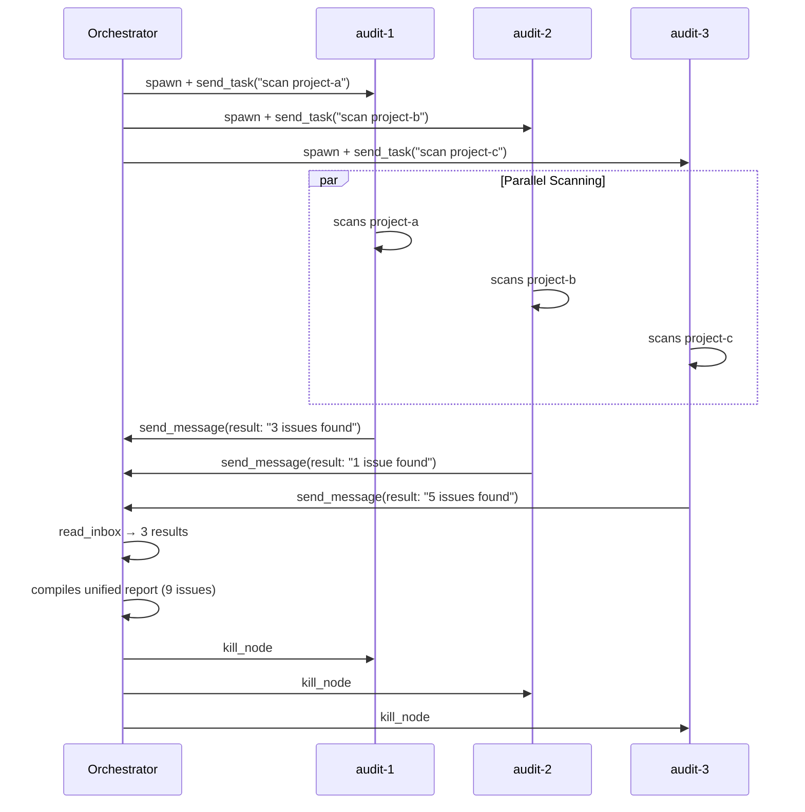

# Multi-Project Security Audit

Multiple agents audit different codebases in parallel, each sending findings back to the orchestrator for a unified report.

## Pattern: Fan-Out + Collect

```
Orchestrator
  ├── audit-1  scans project A → sends findings
  ├── audit-2  scans project B → sends findings
  └── audit-3  scans project C → sends findings
        ↓
Orchestrator collects via read_inbox, compiles unified report
```

## Why Parallel Agents?

Auditing 3 codebases sequentially takes 3x the time. With parallel agents, all 3 run simultaneously. The orchestrator just waits for results in its inbox -- no polling required.

## Expected Message Flow

```
1. Orchestrator spawns 3 workers, sends each a scan task
2. Each worker scans its project directory
3. Each worker sends findings to orchestrator via send_message(msg_type="result")
4. Orchestrator reads inbox, compiles unified report, kills workers
```

**Messages:** 3 (one result per worker)

### Sequence Diagram



## Prompt

Paste this into an orchestrator node. Adjust the project paths to match your setup:

```
Spawn 3 workers: "audit-1", "audit-2", "audit-3".

Each worker should scan its assigned project directory for security issues:
- Hardcoded API keys, tokens, or passwords
- eval() or exec() usage
- SQL injection risks (string concatenation in queries)
- Missing input validation on API endpoints
- Sensitive data in logs

Summarize findings as a short report (max 10 issues, sorted by severity).
Then send_message the report to me (your parent, use get_my_info for parent_id)
with msg_type="result".

Assignments:
- audit-1: scan /path/to/project-a
- audit-2: scan /path/to/project-b
- audit-3: scan /path/to/project-c

Once all 3 workers have sent results (check read_inbox periodically), compile
a unified security report sorted by severity across all projects. Kill all
workers when done.
```

## What Success Looks Like

- All 3 workers scan their projects simultaneously
- Each sends a structured findings report to the orchestrator
- Orchestrator's inbox contains 3 result messages
- Final report aggregates issues across all projects by severity
- Workers killed after collection
