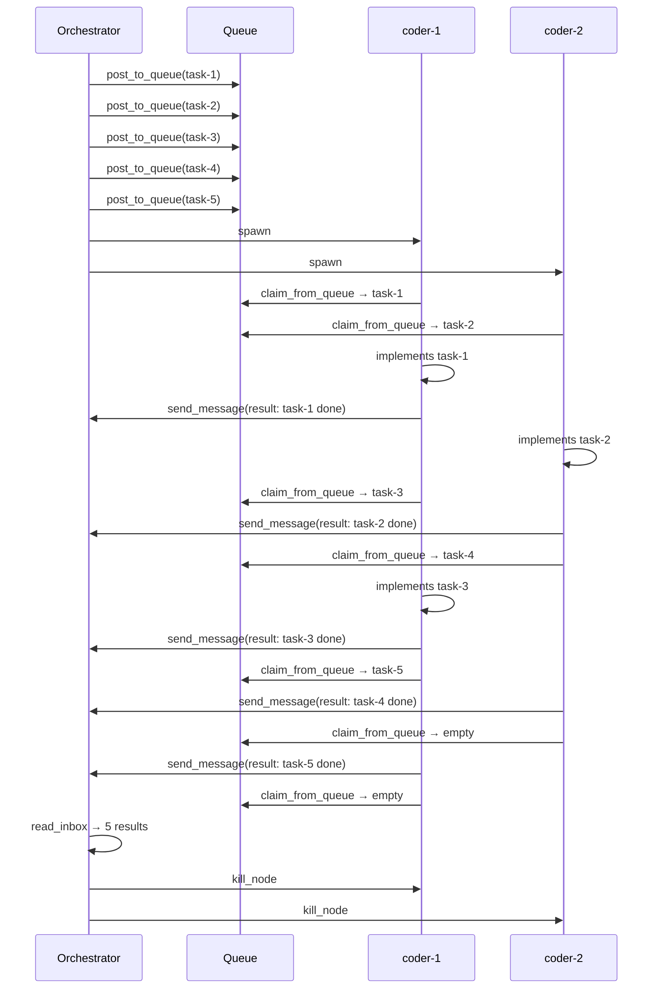

# Work Queue Task Board

Tasks are posted to a shared queue. Multiple workers compete to claim and execute them. Faster workers handle more tasks automatically.

## Pattern: Competing Consumers

```
Queue: [task-1] [task-2] [task-3] [task-4] [task-5]

  coder-1 claims task-1 ──→ executes ──→ claims task-3 ──→ executes ──→ claims task-5
  coder-2 claims task-2 ──→ executes ──→ claims task-4 ──→ executes ──→ (queue empty)

Both workers send results to orchestrator via send_message
```

## Why a Work Queue?

Traditional orchestration assigns tasks upfront -- if one worker is slower, the others sit idle. A work queue distributes dynamically: fast workers claim more tasks. No task is assigned twice (atomic claiming).

## Expected Message Flow

```
1. Orchestrator posts 5 tasks to queue via post_to_queue
2. Orchestrator spawns 2 workers
3. Each worker: claim_from_queue → execute → send_message(result) → repeat
4. Workers stop when claim_from_queue returns "No tasks available"
5. Orchestrator collects all results via read_inbox
```

**Messages:** 5 results + claim/execute cycles

### Sequence Diagram



## Prompt

Paste this into an orchestrator node:

```
Post these 5 tasks to the shared work queue using post_to_queue:
1. "Write a Python function that validates email addresses using regex"
2. "Write a bash one-liner that finds the 10 largest files in the current directory"
3. "Write a Python function that converts a nested dictionary to a flat dictionary with dot-notation keys"
4. "Write a Python decorator that retries a function up to 3 times on exception"
5. "Write a bash function that shows git branch age (last commit date) for all branches"

Then spawn 2 workers: "coder-1" and "coder-2".

Each worker should: call claim_from_queue() to get a task, implement it, send
the solution to me (parent, use get_my_info for parent_id) via send_message
with msg_type="result" including which task they completed. Then call
claim_from_queue() again. Repeat until no more tasks are available.

Monitor progress. Once both workers are idle and all results collected via
read_inbox, summarize which worker completed which tasks and how many each
did. Kill workers when done.
```

## What Success Looks Like

- All 5 tasks claimed exactly once (no duplicates)
- Work distributed dynamically (one worker may handle 3, the other 2)
- Each result message identifies the task and worker
- Orchestrator's final summary shows the distribution
- Queue is empty at the end
